 
 

<div align="center">
 <h1>CakeFactory: Full-Stack Web Application</h1>
 <a href="#"></a>
</div>

<br />

<div align="center">
  
  
  
  
</div>

<div align="center">
  
  
</div>

<div align="center">
  
  
  
  
</div>

<div align="center">
    <a href="#about">About</a> •
    <a href="#features">Features</a> •
    <a href="#visuals">Key Visuals</a> •
    <a href="#tech">Tech Stack</a> •
    <a href="#installation">Installation</a> •
    <a href="#database">Database</a> •
    <a href="#api">API</a> •
    <a href="#future">Future Features</a>
</div>

---

<a name="about"></a>
## 💡 About the Project

**CakeFactory** is a full-stack web application that serves as both a public-facing storefront for browsing cakes and a seamless ordering platform for customers. The frontend is built with modern ReactJS for a responsive and interactive experience, while all data persistence is handled by a robust Java Spring Boot backend connected to a MySQL relational database.

---

<a name="features"></a>
## 🎂 Features

### Public-Facing Site
- **Cake Catalog View:** Displays all available cakes with images, names, and descriptions
- **Dynamic Detail Pages:** Each cake links to a dedicated page showing full details (flavors, sizes, pricing, etc.)
- **Responsive Design:** Fully functional across desktop, tablet, and mobile breakpoints
- **Accessibility:** UI adheres to basic accessibility standards (semantic HTML, image alt text, etc.)

### User Logged in site
- **Add to Cart:** Customers can add cakes to a shopping cart
- **Cart Management:** View, update quantities, and remove items from the cart
- **Order Summary:** Customers can review their full order before checkout

---

<a name="visuals"></a>
## 📸 Key Visuals

### Wireframes 

<details>
  <summary>Click here to toggle view of wireframes.</summary><br />
  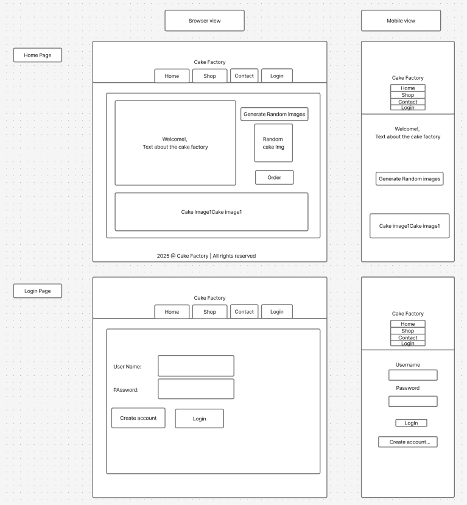
  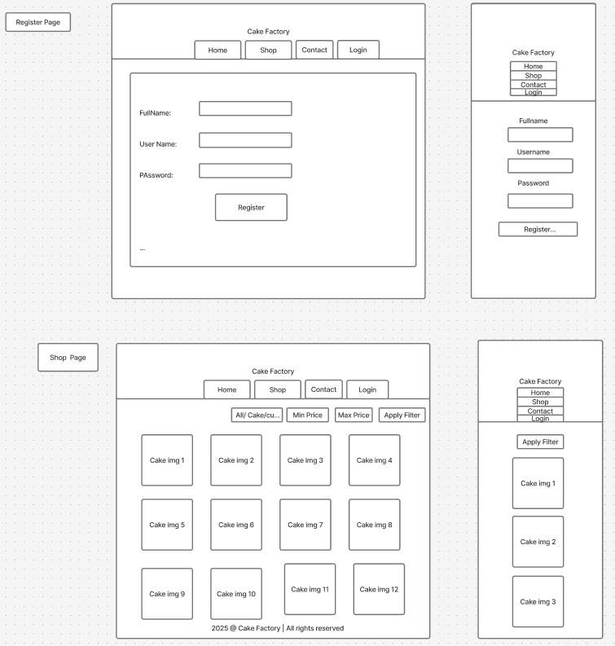
  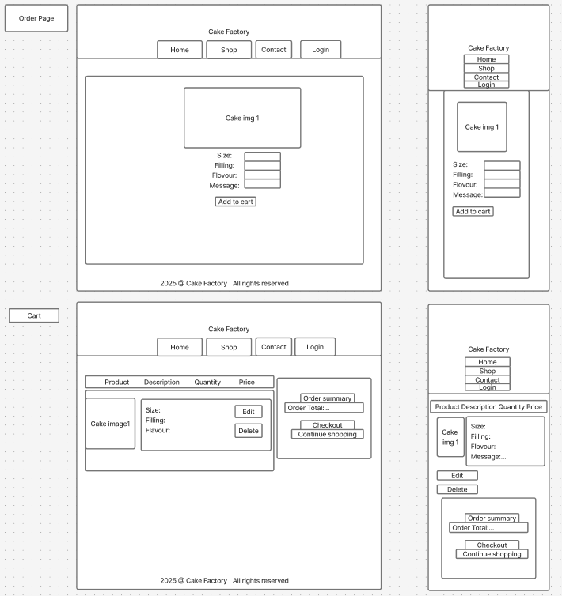
  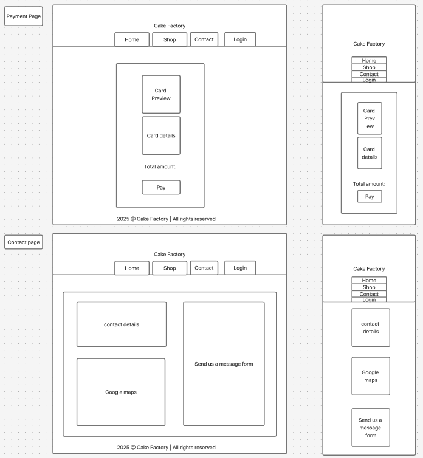
</details>

### Preview of UI

> Click on any of the items below to expand or collapse them.

#### PUBLIC SITE

<details open>
    <summary>Home & Login Page</summary>
    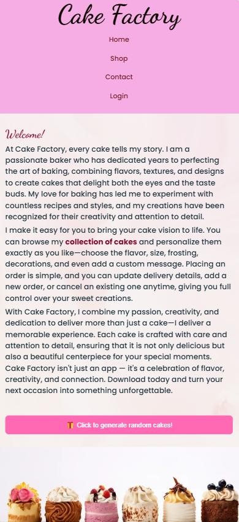
    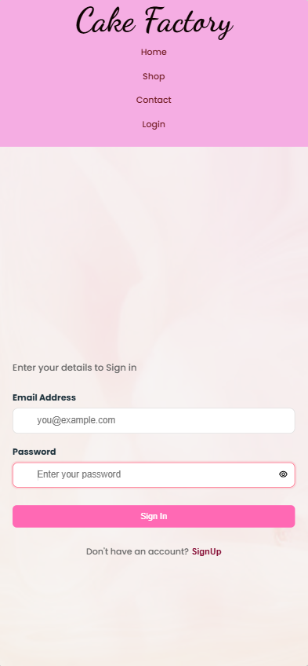
    <summary>Cake Catalog </summary>
    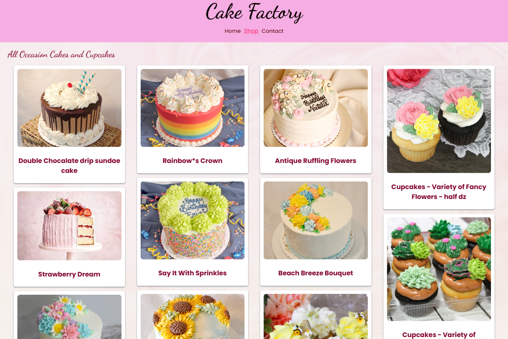
    <summary>Register & Contact Page</summary>
    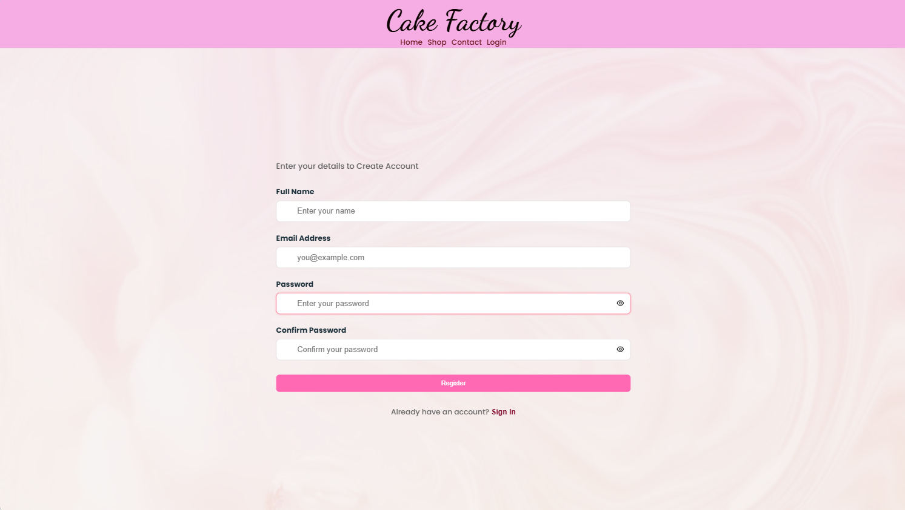
    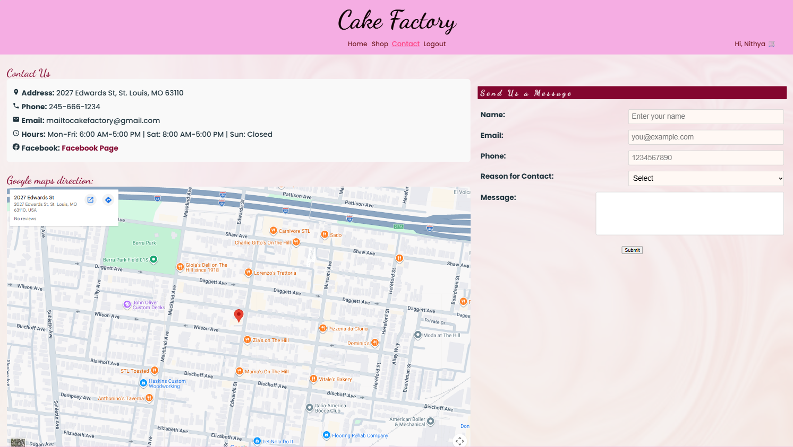
</details>

#### USER LOGGED IN
<details>
    <summary>Cart & Order Summary</summary>
    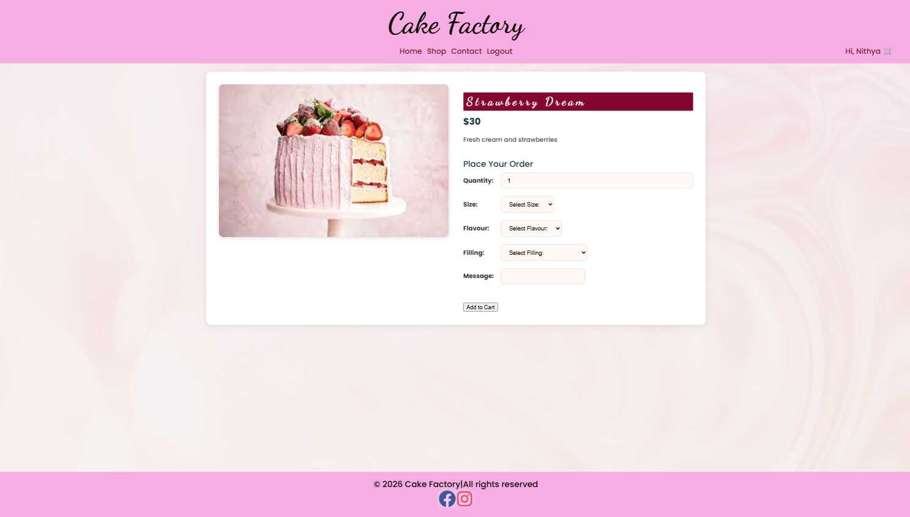
    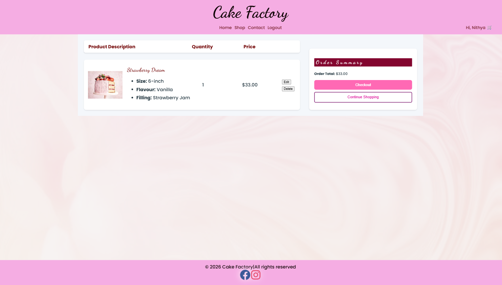
    <summary>Payment Page</summary>
    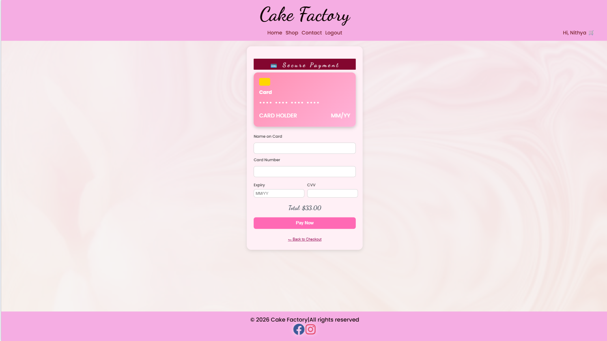
</details>

---

<a name="tech"></a>
## 🛠️ Tech Stack

This full-stack project uses a modern, decoupled MVC architecture.

### Front End

| Technology | Description |
|       ---: | :---        |
|  | Core programming language for dynamic, interactive UI |
|  | Component-based UI architecture with a virtual DOM for efficient rendering |
|  | Declarative, component-based navigation and routing |
|  | Quick cold start and near-instantaneous Hot Module Replacement (HMR) |
|  | Styling, layout, responsiveness, and accessibility improvements |
|  | A vast library of open-source fonts, making high-quality typography easily accessible across the web |

### Back End & Database

| Technology | Description |
|       ---: | :---        |
|  | Core programming language for scalable, robust backend services |
|  | Rapid creation of a standalone RESTful API |
|  | Comprehensive, convention-over-configuration approach that simplifies dependency management |
|  | Object-Relational Mapping (ORM) tool for database interactions |
|  | Relational database for structured data storage |

---

<a name="installation"></a>
## 🚀 Prerequisites & Installation

> [!NOTE]
> To run this project locally, you will need the following installed:
> - Node.js (LTS version)
> - npm or yarn
> - Java Development Kit (JDK) 21
> - MySQL Server (version 8.0+)

---

### Back End Setup (Java / Spring Boot / MySQL)

1. **Clone the repository:**
    ```shell
    git clone https://github.com/nithyagiri/unit-2-project-repo-cakefactory-NithyaGN
    cd cake-factory-back-end
    ```

2. **Configure your database and environment secrets:** Create a new MySQL database named `cakefactory_db`, then create an `.env` file in the backend root directory:
    ```properties
    # Location of your local database server
    DB_HOST=localhost
    DB_PORT=3306

    # Database name
    DB_NAME=cakefactory_db

     # Credentials
    DB_USER=root
    DB_PASS=[your_password]
    ```

3. **Run the Spring Boot application:**
    ```shell
    mvn spring-boot:run
    ```
    
    🟢 The API should now be running on `http://localhost:8080`.

> [!WARNING]
> If you encounter an `UnsupportedClassVersionError`, ensure your `JAVA_HOME` environment variable points to a Java 21 JDK. If using an IDE (IntelliJ, VS Code), verify the project SDK is set to Java 21.

---

4. Insert the values for the cakes table which is already created. Please execute this [sql file : CakeFactory.sql](Documents/cakefactory.sql)
  
   
### Front End Setup (React / Vite)

1. **Navigate to the frontend project directory:**
    ```shell
    cd cakefactory-front-end
    cd CakeFactory
    ```

2. **Install dependencies:**
    ```shell
    npm install
    # or
    # yarn install
    ```

3. **Run the React/Vite application:**
    ```shell
    npm run dev
    # or
    # yarn dev
    ```
    
    🟢 The frontend will be available in your browser at `http://localhost:5173`.

---

<a name="database"></a>
## 🗄️ Database Structure (ERD)

The project uses a MySQL database with the following core entities managed via Hibernate:

1. **Cake** ↔️ **Category**: Many-to-Many
2. **Order** ↔️ **Cake**: Many-to-Many (via OrderItem)
3. **Order** ↔️ **Customer**: Many-to-One

### Entity Relationship Diagram (ERD)

<details open>
  <summary>Click here to toggle view of ERD</summary><br />
   -->
</details>

---

<a name="api"></a>
## ⚙️ API Endpoints

The following RESTful endpoints handle data access and order management.

### Cakes 🎂
| HTTP Method | Endpoint | Description | Access |
| :--- | :--- | :--- | :--- |
| 🟢 `GET` | `/api/cakes` | Retrieve a list of all cakes | 🌎 Public |
| 🟢 `GET` | `/api/cakes/{id}` | Retrieve details for a single cake | 🌎 Public |
| 🟢 `GET` | `/api/cakes/search?name=` | Search cakes by name | 🌎 Public |
| 🟢 `GET` | `/api/cakes/category/{category}` | Get cakes by category | 🌎 Public |
| 🟢 `GET` | `/api/cakes/customizable` | Get all customizable cakes | 🌎 Public |

### Cart 🛒
| HTTP Method | Endpoint | Description | Access |
| :--- | :--- | :--- | :--- |
| 🟢 `GET` | `/api/cart/user/{userId}` | Get all cart items for a user | 🔐 User |
| 🟢 `GET` | `/api/cart/user/{userId}/orders` | Get all confirmed orders for a user | 🔐 User |
| 🟡 `POST` | `/api/cart/add` | Add an item to the cart | 🔐 User |
| 🟡 `POST` | `/api/cart/checkout/{userId}` | Checkout and confirm cart | 🔐 User |
| 🔵 `PUT` | `/api/cart/{id}` | Update a cart item | 🔐 User |
| 🔴 `DELETE` | `/api/cart/{id}` | Delete a single cart item | 🔐 User |
| 🔴 `DELETE` | `/api/cart/user/{userId}` | Clear all cart items for a user | 🔐 User |

### Users 👤
| HTTP Method | Endpoint | Description | Access |
| :--- | :--- | :--- | :--- |
| 🟡 `POST` | `/api/users/register` | Register a new user | 🌎 Public |
| 🟡 `POST` | `/api/users/login` | Login and authenticate a user | 🌎 Public |

---

<a name="future"></a>
## 🔮 Future Features

Several features are scoped for future development:

### Authentication & Admin Portal
- Implement secure login/logout with JWT-based Spring Security
- Build an admin dashboard for full CRUD management of cakes and orders

### Enhanced Ordering
- Implement a checkout flow with delivery date selection
- Send order confirmation emails to customers

---

## 🧑‍💻 Designer & Author

Nithya — [GitHub](https://github.com/nithyagiri) 
